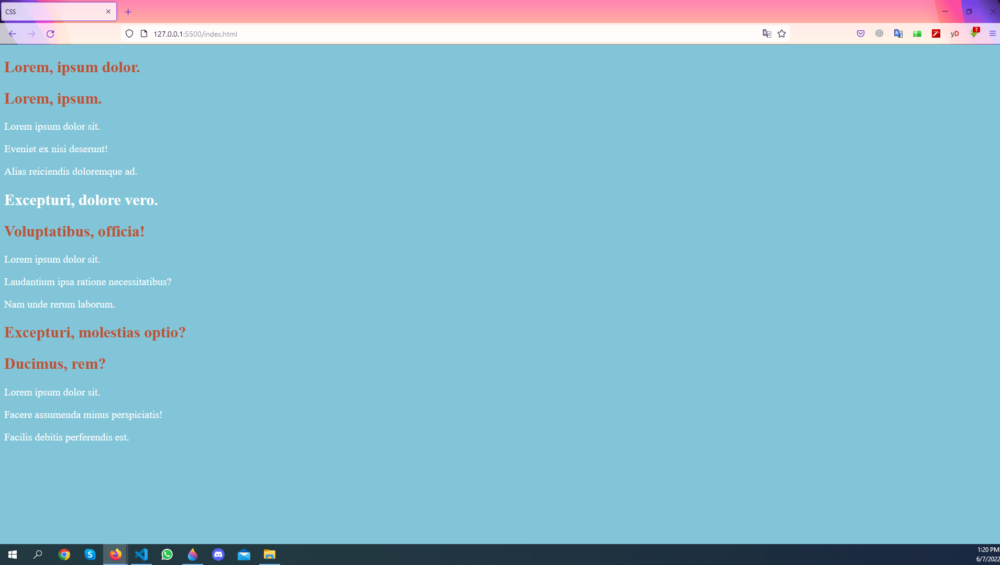

# We are gonna show the using of class and id with CSS.

# The class selector allows us to access the element with the same class on HTML.
# The ID selector allows us to reach the element with the same id on the HTML.

