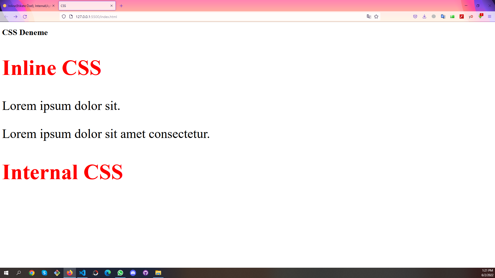

# We are gonna learn the differences between inline css, internal css and external css in this study.
# We sometimes need to use inline css and internal css(only special situations) but genearally we shoul use the external css because of its easy using.

