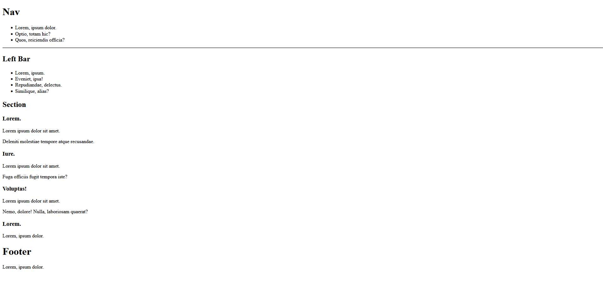

# We are gonna use basic semantic elements in this study.

## I know that it doesn't look very aesthetic but for now it doesn't matter. Because in the near future we are gonna see very attractive and elegant pages. 

## This is a example skeleton of web page that we will create in the future.

